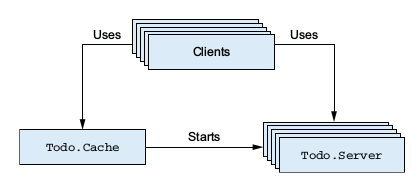
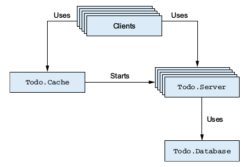

# Elixir in Action Part 2

This month we'll continue our Todo application we started in [part 1](./elixir_in_action_part_1.md)

## Managing multiple Todo lists

Let's recap what we built last time. We have:
 - a pure functional abstraction of a Todo list
 - a Todo server process that maintains the state of one Todo list
 
 In order to extend this code to work with multiple lists, we'll run one instance of our Todo server for each list. To do this,
 we'll introduce a new entity that we'll use to create new Todo lists and lookup existing ones. We'll call this our Todo Cache.
 
 Let's start with a test:
 in `test/todo/cache_test.exs`
```elixir
defmodule Todo.CacheTest do
  use ExUnit.Case

  test "can retrieve a server process from the cache" do
    {:ok, cache} = Todo.Cache.start
    pid = Todo.Cache.server_process(cache, "Bob's List")
    retrieved = Todo.Cache.server_process(cache, "Bob's List")

    assert pid == retrieved
  end
end
``` 
We expect that if we ask for a server process twice, we get the same pid back.

Now, the implementation. So far, nothing too new from what we have done before, basically our cache creates a new Todo.Server for a given
name, or it returns the existing one. It's state is a simple `Map`.

```elixir    
defmodule Todo.Cache do
  use GenServer

  def init(_) do
    {:ok, Map.new}
  end

  def start do
    GenServer.start(__MODULE__, nil)
  end

  def server_process(cache_pid, todo_list_name) do
    GenServer.call(cache_pid, {:server_process, todo_list_name})
  end

  def handle_call({:server_process, todo_list_name}, _, todo_servers) do
    case Map.fetch(todo_servers, todo_list_name) do
      {:ok, todo_server} ->
        {:reply, todo_server, todo_servers}
      :error ->
        {:ok, new_server} = Todo.Server.start
        {
          :reply,
          new_server,
          Map.put(todo_servers, todo_list_name, new_server)
        }
    end
  end
end
```

We'll also ensure we can start multiple todo server processes:
```elixir
  test "can start multiple server processes" do
    {:ok, cache} = Todo.Cache.start
    pid_1 = Todo.Cache.server_process(cache, "Bob's List")
    pid_2 = Todo.Cache.server_process(cache, "Alice's List")

    assert pid_1 != pid_2
  end
```
And that pids we get back are Todo servers we can manipulate:
```elixir
  test "returned pid is a todo list" do
    {:ok, cache} = todocache.start
    bobs_list = todocache.server_process(cache, "bob's list")
    entry = %{date: {2016, 10, 01}, title: "dentist"}
    todoserver.add_entry(bobs_list, entry)

    assert todoserver.entries(bobs_list, {2016, 10, 01}) == [map.put(entry, :id, 1)]
  end
```
And ensure everything still passes.

Just for fun, let's prove that we can create a lot todo list processes without breaking a sweat. In iex, let's do:

```elixir
{:ok, cache} = Todo.Cache.start
length(:erlang.processes)
1..100_000 |>
  Enum.each(fn(index) ->
    Todo.Cache.server_process(cache, "to-do list #{index}")
  end)
length(:erlang.processes)
```

## Analysing process dependencies 
Let's take a look at our system so far. Our goal is for this system to be used in a HTTP server - which typically use a process per client request in the erlang/elixir world. If we have many concurrent users, we can expect many processes to be accessing our Todo Cache and Todo Server processes.



In this image, each box represents a process. You can see:
 - multiple client processes access a single Todo Cache
 - multiple client processes use multiple Todo Server processes 
 
This first property could be the source of a bottleneck - we can only handle one `server_process` request simultaneously, no matter
how many CPUs we have. This may not be significant in practice, but is a good consideration to be aware of. Given our Cache performs a simple `Map` lookup or insert, and we need a consistent state of existing todo lists, we'll accept this trade-off for our initial attempt.

## Persisting Data

So far, our data is only in memory. If we shut down our process, or our server dies, we have lost our users Todo lists.
Let's do some persistence. To keep things simple, we're just going to write it locally to disk. Obviously, if we're running multiple
servers in production, writing locally to disk isn't going to cut it, but it serves our purpose for exploring processes right now.

So, we'll introduce a `Database` service, that has `store` and `get` functions. Here is a test:
In `test/database_test.exs`:

```elixir
defmodule DatabaseTest do
  use ExUnit.Case

  test "can store and retrieve values" do
    Todo.Database.start("database/test")
    Todo.Database.store("my key", %{this_is: "anything"})

    assert Todo.Database.get("my key") == %{this_is: "anything"}
  end
end
```

Simple, but enough for now. Perhaps we could do more to ensure it is actually peristed to disk, e.g. kill the process then try
our `get`. We'll do that in the next test, which tests a Todo Server persists its data.

In `test/todo/server_test.exs`:

```elixir
  test "should persist entries", %{todo_server: todo_server} do
    Todo.Server.add_entry(todo_server,
      %{date: {2016, 9, 22}, title: "Elixir Meetup"})

    :timer.sleep(500)
    Process.exit(todo_server, :kill)

    {:ok, todo_server2} = Todo.Server.start("myserver")

    assert todo_server != todo_server2
    assert Todo.Server.entries(todo_server2, {2016,9,22}) ==
      [%{id: 1, date: {2016, 9, 22}, title: "Elixir Meetup"}]
  end
```
You'll notice I now expect some context passed in to my test, I added a `setup` to remove some duplication with the
existing test:
```elixir
  setup do
    Todo.Database.start("./database/test")
    {:ok, todo_server} = Todo.Server.start("myserver")
    :ok = Todo.Server.clear(todo_server)

    %{todo_server: todo_server}
  end
```
First, our server expects the database process to be started. We'll look at better ways to do this when we look at supervision,
but for now, it'll suffice to start it directly whereever convenient.

Second, we've added a parameter to `Todo.Server.start`, so that it has a name it can use to persist the data under. Update the existing test use the context from the setup too.

You'll notice a `:timer.sleep` call in there. Why is it there? Because our `add_entry` call is asynchronous, if we put that
message in the mailbox of the Todo.Server, and immediately kill it, it may never be processed. For the purposes of this test, we want
to ensure the entry is written to disk, to that when we start another server with the same name, we can check it has read it.

Further to this, in order to have reproducable tests, we needed a way to clear our database. Otherwise, a second test run would append to our existing entry list, and it would contain more entries than we expect.

To implement the clear functionality, this is what I added to Todo.Server:
In `lib/todo/server.ex`:
```elixir
  def handle_call(:clear, _, {name, todo_list}) do
    todo_list = TodoList.new
    Todo.Database.store(name, todo_list)
    {:reply, :ok, {name, todo_list}}
  end

  def clear(todo_server) do
    GenServer.call(todo_server, :clear)
  end
```

I also add a `Todo.Server.clear` call in the `Todo.CacheTest`, which otherwise will keep appending to a list every run.

If we run our tests now, we'll find there are a few things we need to fix. Here are some things to change in `Todo.Server`:

Use the new parameter to persist the data on an `add_entry` call.

```elixir
  def handle_cast({:add_entry, new_entry}, {name, todo_list}) do
    todo_list = TodoList.add_entry(todo_list, new_entry)
    Todo.Database.store(name, todo_list)
    {:noreply, {name, todo_list}}
  end
```

Notice, we now pass arount a tuple of `{name, todo_list}` to keep the name around. We'll need to update other functions in this
module to do this too.

The `init` function also reads the database to get existing state from disk. If none exists, it starts a new list:

```elixir
  def init(name) do
    {:ok, {name, Todo.Database.get(name) || TodoList.new}}
  end
```

You'll also find that the `Todo.Cache` test is failing, because the `Todo.Server` expects the database to already have been started.
For now, we'll add a very hacky solution of starting the database when the cache starts, in it's `init` function:

In `lib/todo/cache.ex`:

```elixir
  def init(_) do
    Todo.Database.start("./database")
    {:ok, Map.new}
  end
```
There are obvious problems with this approach...but let's roll with it for now. We'll make it better later. All the existing tests should be able to pass from there, and we should see some data persisted to disk.

Alright! We have persistence! Our implementation so far is shaky at best...but we'll learn some ways to tighen this up next.

## Analysing the system

Let's have another think about how our processes are working together in our system. We introduced just one database process, but it 
can have a negative impact on our whole systems performance. Our database process performs term encoding/decoding, not to mention
filesystem access.



Let's look at where we call our database process:
 - In `Todo.Server.init`, we do `Todo.Database.get` to load state from disk.
 - In the `handle_cast` for `Todo.Server.add_entry`, we do a `Todo.Database.store`.
 
The `store` call might seem harmless, since it's in an asynchronous cast. A client issues the request and continues on it's merry
way without blocking. However, if requests arrive faster than they can be handled, the message queue for the Database will grow until
eventually we run out of memory and possibly crash the BEAM.

The `get` call is also problematic. It's synchronous, so the `Todo.Server` waits for the response. While it's waiting, that `Todo.Server`
can't handle new messages. What is worse, however, is that because this is happening inside `init`, our single `Todo.Cache` process
is blocked while the filesystem is read. Under a heavier load, this could render our system useless.

## Addressing the bottleneck

What can we do? Obviously we need to address the bottleneck caused by our singleton database process.

### Bypass the process
Does this need to be a process, or can it be a plain module? Here are some reasons for a dedicated server process. 
 - Must manage some long lived state
 - Manages a resource that must be reused, e.g. a TCP connection, database connection, file handle, pipe to an OS process.
 - Syncronise a critical section of code - only one process can run some code at a time.
 
 Our database must be synchronised on individual items - we can't simultaneously write to the same file from multiple processes.
 
### Handle requests conccurrently
Another option is to keep the Database process, but it spawn child processes for any actions, so each action is run concurrently.
This would help our Database process remain responsive, and would be valid for certain scenarios. For ours, however, it doesn't prevent
concurrent read/writes to the same file, and concurrently is unbounded. If we have 100,000 concurrent requests, we'll have 100,000 concurrent filesystem operations, which could bring down the performance of the whole system.

### Limiting concurrency with pooling
A common solution to this is to introduce pooling. Our database would start a set number of workers and delegate all requests to a worker.
This allows our Database process to remain responsive, while keeping concurrency under control. It also allows us to send actions for
the same item to the same worker, forcing those to be synchronised, yet allowing concurrent operations.

_note:_ In real life, you would need to constrain the number of simultaneous operations sent to a database, this is purpose of pooling.
There are great existing libraries in elixir/erlang (e.g. poolboy), and you don't need to write this yourself.

## Database Pooling
To introduce database pooling, here are the steps we'll take:
 - Introduce `Todo.DatabaseWorker`, similar to existing `Todo.Database` but not registered under global alias.
 - During `Todo.Database` initialisation, start N workers, store their pids in a Map.
 - `Todo.Database.get_worker` returns a pid for a given key. Use `:erlang.phash2(key, n)` to calculate numberical hash
 and normalise to relevant range.
 - `store` and `get` of `Todo.Database` obtain a workers `pid` and forward to interface functions of `DatabaseWorker`
 
 First, I'll write a test for our database worker. It's similar to our existing database module, but expects a `pid` to be passed
 to it's functions, since we have more than one.

```elixir
defmodule Todo.DatabaseWorkerTest do
  use ExUnit.Case
  alias Todo.DatabaseWorker

  test "can store and retrieve values" do
    {:ok, pid} = DatabaseWorker.start("database/test")
    DatabaseWorker.store(pid, "my key", %{this_is: "anything"})

    assert DatabaseWorker.get(pid, "my key") == %{this_is: "anything"}
  end
end
```

Here is our implemention, again similar to our existing database, but the worker keeps it's `db_folder` as it's state.
We expect each worker to have a unique folder, so each worker has exclusive access to that directory.

```elixir
defmodule Todo.DatabaseWorker do
  use GenServer

  def start(db_folder) do
    GenServer.start(__MODULE__, db_folder)
  end

  def store(pid, key, data) do
    GenServer.cast(pid, {:store, key, data})
  end

  def get(pid, key) do
    GenServer.call(pid, {:get, key})
  end

  def init(db_folder) do
    File.mkdir_p(db_folder)
    {:ok, db_folder}
  end

  def handle_cast({:store, key, data}, db_folder) do
    file_name(db_folder, key)
    |> File.write!(:erlang.term_to_binary(data))
    {:noreply, db_folder}
  end

  def handle_call({:get, key}, _, db_folder) do
    data = case File.read(file_name(db_folder, key)) do
             {:ok, contents} -> :erlang.binary_to_term(contents)
             _ -> nil
           end
    {:reply, data, db_folder}
  end

  defp file_name(db_folder, key), do: "#{db_folder}/#{key}"
end
``` 

Here is our updated `Database` module, which now uses `DatabaseWorker`.

We alias our worker module, set a number of workers. Obviously a future enhancement could make this configurable,
but for now this will do.

Our init function now spawns our database workers, passing in the base directory. The state maintained
by the Database process is now a Map of database worker pids.

We'll add `get_worker` interface function and callback to return a worker pid for a given key. 

Our `get` and `store` functions now just delegate to our worker processes, using `get_worker` to look one up.

```elixir
defmodule Todo.Database do
  use GenServer
  alias Todo.DatabaseWorker

  @num_workers 10

  def start(db_folder) do
    GenServer.start(__MODULE__, db_folder,
      name: :database_server
    )
  end

  def store(key, data) do
    DatabaseWorker.store(get_worker(key), key, data)
  end

  def get(key) do
    DatabaseWorker.get(get_worker(key), key)
  end

  def get_worker(key) do
    GenServer.call(:database_server, {:get_worker, key})
  end

  def init(db_folder) do
    File.mkdir_p(db_folder)
    worker_pids = Enum.reduce(0..@num_workers, %{}, fn index, map ->
      {:ok, pid} = DatabaseWorker.start(db_folder)
      Map.put(map, index, pid)
    end)

    {:ok, worker_pids}
  end

  def handle_call({:get_worker, key}, _, worker_pids) do
    index = :erlang.phash2(key, @num_workers)
    pid = Map.get(worker_pids, index)
    {:reply, pid, worker_pids}
  end

end
```

## Fault Tolerance

We've previously talked about erlang's "let it crash" philosophy. The basic idea is that rather than try to predict and
explicity handle every failure scenario, we can build much more resilient systems by instead building in the ability
to self-heal from any expected scenario. Rather than allow our whole system to crash, we can allow the single process or part our
system with the failure to crash and be restarted automatically in a clean state.

There are a few problems with our system in terms of resilience at the moment. Let's break it in iex:
```elixir
alias Todo.{Cache, Server}
{:ok, cache} = Cache.start
bobs_list = Cache.server_process(cache, "bob's list")
Server.entries(bobs_list, {2016, 10, 01})

Process.exit(bobs_list, :kill)
Server.entries(bobs_list, {2016, 10, 01})

bobs_list = Cache.server_process(cache, "bob's list")
Server.entries(bobs_list, {2016, 10, 01})
```

First, we get a list process as normal, and check it's entries. Then, we kill it, to pretend it dies somehow. In
reality, this might be for any reason, an exception was thrown, and the process crashed. If we try use bob's list 
hereafter, it fails. Even worse, trying to get bob's list from the cache again gives us the same stale pid, so we
are totally unable to use bob's list. 

Similarly, if our cache process dies, no new clients can get any Todo lists to work with at all:
```elxiir
alias Todo.{Cache, Server}
{:ok, cache} = Cache.start
bobs_list = Cache.server_process(cache, "bob's list")

Process.exit(cache, :kill)

anns_list = Cache.server_process(cache, "ann's list")
```
Let's fix this with a supervisor.

## Adding a supervisor
We'll add a supervisor to the Todo Cache first - since it is currently the entry point to our system. There are a few minor changes
required.

Supervisors use links to manage child processes, so we need to provide a `start_link` instead of our `start` function.
We'll also register it under a global alias, since we want to only have one cache. This allows callers not to have to
pass the pid in for the process.
```elixir
  def start_link do
    IO.puts "Starting to-do cache."
    GenServer.start_link(__MODULE__, nil, name: :todo_cache)
  end

  def server_process(todo_list_name) do
    GenServer.call(:todo_cache, {:server_process, todo_list_name})
  end
```


we can now add our supervisor. Elixir provides a helper in the form of the `Supervisor` module. To define a supervisor,
you must define an `init/1` function that return a 'specification' - a description of the child processes to be started
and supervised. Let's see it in code.

`/lib/todo/supervisor.ex`
```elixir
defmodule Todo.Supervisor do
  use Supervisor

  def start_link do
    Supervisor.start_link(__MODULE__, nil)
  end

  def init(_) do
    processes = [worker(Todo.Cache, [])]
    supervise(processes, strategy: :one_for_one)
  end
end
```

The result of this function is a tuple that describes the supervisor. Note the `strategy: :one_for_one`, this is known as a
restart strategy. This strategy means "If a child crashes, start another one.". There a few others, e.g. "Restart all children
when a single child crashes.". We'll look at these later.

Let's try our supervisor in iex.
```elixir
Todo.Supervisor.start_link
 #-> Starting to-do cache.
 #-> {:ok, #PID<0.157.0>}

Process.whereis(:todo_cache) |> Process.exit(:kill)
 #-> Starting to-do cache.
 #-> true

Process.whereis :todo_cache
 #-> #PID<0.173.0>

bobs_list = Todo.Cache.server_process("Bob's list")
 #-> #PID<0.177.0>
```

One thing to note is the reason we regisistered our cache under a local alias, is to allow process discovery. You can see that
a supervised process may be restarted, in which case it will have a different pid. Registering the process allows any
clients to look up the current pid for that process.

## Linking all processes

Another thing to note from our supervisor example, is that terminating our cache process leaves it's children dangling. This is a 
potential source of resource/memory leaks. Let's try it.

```elixir 
length(:erlang.processes)
 # 88

Process.whereis(:todo_cache) |> Process.exit(:kill)
 # Starting to-do cache.
 # true

bobs_list = Todo.Cache.server_process("Bob's list")
 # #PID<0.191.0>
 
length(:erlang.processes)
 # 89

Process.whereis(:todo_cache) |> Process.exit(:kill)
 # Starting to-do cache.
 # true

bobs_list = Todo.Cache.server_process("Bob's list")
 # #PID<0.196.0>

length(:erlang.processes)
 # 90
```

Every time we kill the cache and access bob's list, a new instance in created, because our new cache has no reference to the
old bob's list. Terminating a todo cache destroys it's state, so we should also take down all existing todo servers, so we can unsure
clean termination. To do this, each server process must be linked to the cache. We'll also link the database server to the cache, and
the database workers to the server. This is the primary way to ensure process consistency - by linking a group of processes, we
ensure the crash of a process takes down it's dependencies as well. Regardless which process crashed, our entire structure will
be restarted in a clean state.

The downside of this is that an error in one process has a wide impact - an error in one database worker will bring down the entire
structure. This is far from perfect, but let's roll with it for now. We'll improve this later.

To make this change, we simply change `start` to `start_link` for all our processes. Let's do that, and try our previous example again.
Note, for `Todo.Server`, I kept both `start` and `start_link`, as we have an existing test that starts and kills a server process.
If `start_link` is used, it brings down the test process too! This obviously cuases the test to fail.

Let's try our little test again, to see if we're leaking processes.

```elixir
Todo.Supervisor.start_link
# nil
bobs_list = Todo.Cache.server_process("Bob's list")
# #PID<0.161.0>
length(:erlang.processes)
# 88
Process.whereis(:todo_cache) |> Process.exit(:kill)
# true
bobs_list = Todo.Cache.server_process("Bob's list")
# #PID<0.184.0>
length(:erlang.processes)
# 88
```
Ah ha. We have a stable number of processes, meaning all our children processes were being cleaned up and restart properly.

### Restart Frequency

Let's try another quick thing in iex:

```elixir
for _ <- 1..6 do
  Process.whereis(:todo_cache) |> Process.exit(:kill)
  :timer.sleep(200)
end
```

Our supervisor will only restart a process a certain number of times within a certain timeframe. The default maximum
restart frequency is 5 times in 5 seconds. The reason behind this, is that if a process restarts too many times in a given interval,
continually restarting it isn't going to solve the problem, and terminating itself is the only sensible thing the supervisor can do.
This allows the supervisor to propagate the error upstream, which is often useful when you have nested hierachies of supervisors.

## Isolating Error Effects
So far, we've looked at the basic theory of error handling in concurrent systems using supervisors. The basic idea is to have
a process whose only job is to restart other processes if they crash.

Isolating error effects can have a big impact on system availability. If there is a problem with our database, we should be able continue to serve requests from the cache where possible, at least providing partial service. Taking it further, an error in a single database
worker shouldn't affect other database operations. If we can isolate error effects to a small part of the system, our system should
be able to provide most of it's service all of the time.

In our Todo system so far, however, our recovery approach is too coarse. An error in any of our processes brings down the whole tree.
This is primarily because we are starting workers from other workers, what we are going to introduce next is supervisors for each part
of the system.

### Separating loosely dependent parts
First, we'll move the database server so it's started directly by the superviser. We must remove the call to `Todo.Database.start_link`
from `Todo.Cache`, and then add another worker to our supervisor:

in `lib/todo/supervisor.ex`
```elixir
  def init(_) do
    processes = [
      worker(Todo.Cache, []),
      worker(Todo.Database, ["./database"])
    ]
    supervise(processes, strategy: :one_for_one)
  end
```

Now, our Database and Cache are restarted independently - If an error occurs in a Database worker, clients can continue to
use the cache while it is restarting. By adding some `puts` statements when our processes start, we can try it in iex:

```elixir
Todo.Supervisor.start_link
# Starting to-do cache.
# Starting database server.
# Starting database worker.
# Starting database worker.
# Starting database worker.
# Starting database worker.
# Starting database worker.
# Starting database worker.
# Starting database worker.
# Starting database worker.
# Starting database worker.
# Starting database worker.
# Starting database worker.

Process.whereis(:database_server) |> Process.exit(:kill)
# Starting database server.
# true
# Starting database worker.
# Starting database worker.
# Starting database worker.
# Starting database worker.
# Starting database worker.
# Starting database worker.
# Starting database worker.
# Starting database worker.
# Starting database worker.
# Starting database worker.
# Starting database worker.
# {:ok, #PID<0.263.0>
```

Note, the todo cache is not restarted when we kill the database server.

## Rich process discovery

So, we have basic error isolation, but it still leaves a lot to be desired. If one of our database workers crashes, it will
bring down all of them. What we need is to have each database worker directly supervised. There is a problem, however, recall that
our database server currently stores a Map of worker pids. A property of the supervisor pattern is that you can't hold onto the pid
of another process for a long time, because that process may die and be restarted with a new pid. We need a way to lookup pids
for database workers, using a symbolic name.

We could use registered aliases for this, as we have for the database server etc, but these only allow atoms as process names. What
we want to be able to lookup processes by something more elaborate, e.g. `{:database_worker, 1}`. 

Note, we could dynamically generate atoms like `:database_worker_1`, but this is not generally a good practice due to garbage
collection properties of atoms (they are never garbage collected).

We're going to introduce a Process Registry component that allows process aliases to be arbitrarily complex.

Note, in a real project you don't need to build this yourself. We're doing this for demonstration purposes to understand more
about how processes work. There are great 3rd party libraries, such as gproc that provide this and more functionality.

We're going to add a new server process, via a `Todo.ProcessRegistry` module. The module will have
 - `ProcessRegistry.register_name`
 - `ProcessRegistry.whereis_name`
functions. These are going to conform to a specific convention with will allow us to use a GenServer feature 'via tuples`.

### Via Tuples
Via tuples allow us to combine our custom process registry with the existing GenServer behaviour. A via tuple is a tuple of
the form `{:via, module, alias}` which we can send to GenServer functions such as `start_link`, `call` and `cast`, that
instruct it to delegate process discovery to our custom module. e.g.:

```elixir
GenServer.call(
{:via, Todo.ProcessRegistry, {:database_worker}, 1},
{:get, key}
)
```

Let's create our process registry. As always, let's start, with a test.

```elixir
defmodule Todo.ProcessRegistryTest do
  use ExUnit.Case
  alias Todo.ProcessRegistry

  setup do
    ProcessRegistry.start_link
    :ok
  end

  test "can register a process" do
    ProcessRegistry.register_name({:database_worker, 1}, self)
    pid = Todo.ProcessRegistry.whereis_name({:database_worker, 1})

    assert pid == self()
  end

  test "should remove dead processes" do
    pid = spawn(fn -> :timer.sleep(:infinity) end)
    ProcessRegistry.register_name({:dead_man_walking}, pid)
    assert ProcessRegistry.whereis_name({:dead_man_walking}) == pid

    Process.exit(pid, :kill)
    :timer.sleep(100)

    assert ProcessRegistry.whereis_name({:dead_man_walking}) == :undefined
  end

  test "can use with via tuples" do
    via_tuple = {:via, Todo.ProcessRegistry, {:database_worker, 1}}
    GenServer.start_link(Todo.DatabaseWorker, "database/viatest", name: via_tuple)
    GenServer.cast(via_tuple, {:store, "somekey", :some_data})
    :timer.sleep(100)
    value = GenServer.call(via_tuple, {:get, "somekey"})

    assert value == :some_data
  end
end
```

And here is our implementation. It is pretty much a rehash of concepts we've seen before.

```elixir
defmodule Todo.ProcessRegistry do
  use GenServer
  import Kernel, except: [send: 2]

  def start_link do
    GenServer.start_link(__MODULE__, nil, [name: :todo_process_registry])
  end

  def init(_) do
    {:ok, %{}}
  end

  def register_name(key, pid) do
    GenServer.call(:todo_process_registry, {:register_name, key, pid})
  end

  def whereis_name(key) do
    GenServer.call(:todo_process_registry, {:whereis_name, key})
  end

  def deregister_pid(process_registry, pid) do
    process_registry
    |> Enum.filter(fn {key, value} ->
      value != pid
    end)
    |> Enum.into(%{})
  end

  def handle_call({:register_name, key, pid}, _, process_registry) do
    case Map.get(process_registry, key) do
      nil ->
        Process.monitor(pid)
        {:reply, :yes, Map.put(process_registry, key, pid)}
      _ ->
        {:reply, :no, process_registry}
    end
  end

  def handle_call({:whereis_name, key}, _, process_registry) do
    {
      :reply,
      Map.get(process_registry, key, :undefined),
      process_registry
    }
  end

  def handle_info({:DOWN, _, :process, pid, _}, process_registry) do
    {:noreply, deregister_pid(process_registry, pid)}
  end

  def send(key, message) do
    case whereis_name(key) do
      :undefined -> {:badarg, {key, message}}
      pid ->
        Kernel.send(pid, message)
        pid
    end
  end
end
```

A couple of things to note. The `handle_info` function allows us to handle messages from our monitored process, to handle them dying. 
Our `send` function is something we have to provide to allow via tuples for GenServer.

Let's use our new registry to properly supervise our database workers. We need to:
 - Have each database worker register with our process registry
 - Use the registry to discover workers
 - Create a supervisor to supervise the pool of workers.
 
To do that, we just use via tuples, as we did in our test.

in `lib/todo/database_worker.ex`
```elixir
def start_link(db_folder, worker_id) do
  IO.puts "Starting the database worker #{worker_id}"
  GenServer.start_link(__MODULE__, db_folder, name: via_tuple(worker_id))
end

defp via_tuple(worker_id) do
    {:via, Todo.ProcessRegistry, {:database_worker, worker_id}}
end

def store(worker_id, key, data) do
  GenServer.cast(via_tuple(worker_id), {:store, key, data})
end

def get(worker_id, key) do
  GenServer.call(via_tuple(worker_id), {:get, key})
end
```
(replace existing `store` and `get` implementations)

Now, we could add our workers under the existing supervisor, but in order to isolate the database component of our system,
we're going to add them under their own supervisor.

in `lib/todo/pool_supervisor.ex`
```elixir
defmodule Todo.PoolSupervisor do
  use Supervisor

 def start_link(db_folder, pool_size) do
    Supervisor.start_link(__MODULE__, {db_folder, pool_size})
  end

  def init({db_folder, pool_size}) do
    processes = for worker_id <- 1..pool_size do
      worker(
        Todo.DatabaseWorker, [db_folder, worker_id],
        id: {:database_worker, worker_id}
      )
    end
    supervise(processes, strategy: :one_for_one)
  end
end
```

### Removing the database process

Now that we have our process registry, don't actually need our database server - there is no more state to keep!
We'll simplify it to delegate to the pool supervisor and process registry.

in `lib/todo/database.ex`
```elixir
defmodule Todo.Database do
  @pool_size 3

  def start_link(db_folder) do
    Todo.PoolSupervisor.start_link(db_folder, @pool_size)
  end

  def store(key, data) do
    key
    |> choose_worker
    |> Todo.DatabaseWorker.store(key, data)
  end

  def get(key) do
    key
    |> choose_worker
    |> Todo.DatabaseWorker.get(key)
  end

  defp choose_worker(key) do
    :erlang.phash2(key, @pool_size) + 1
  end
end
```

### Starting it all up
Now we have a few final changes to our `Todo.Supervisor`, and we should be set.

```elixir
defmodule Todo.Supervisor do
  use Supervisor

  def start_link do
    Supervisor.start_link(__MODULE__, nil)
  end

  def init(_) do
    processes = [
      worker(Todo.ProcessRegistry, []),
      supervisor(Todo.Database, ["./persist/"]),
      worker(Todo.Cache, [])
    ]
    supervise(processes, strategy: :one_for_one)
  end
end
```

Notice the use of `superviser` instead of `worker`. This information is mostly used for hot code upgrades.
Our database workers are now properly supervised!
A few of our tests need updating for our new implementation - I'll leave that as an exercise for the reader!
Note, there are still improvements we can make to our
supervision tree, but we'll build on this next time.

