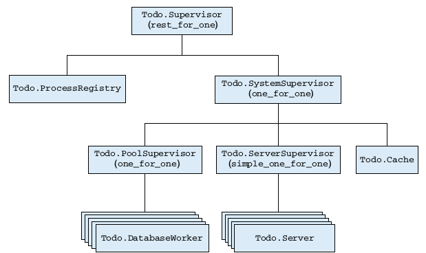

# Elixir in Action - Part 3
Over the last couple of months, we've been building up our Todo application. If you missed those sessions, don't worry! There are interesting things to pick at each stage of the journey.

Let's recap what we did last time.
 - We introduced a `Todo.Cache` to look up existing ToDo servers, so we can work with multiple Todo lists.
 - We added simple persistence - just writing the list to a file on disk. We split this into multiple workers, so separate files could be written to concurrently.
 - We changed our Database module to be a supervisor for our pool of database workers. To do this we needed to use some non-standard process registration, so we implemented our own `Todo.ProcessRegistry`. (Note: there are good libraries available, you don't really need to implement your own.) 
 - We updated our database workers to register themselves, and deregister when they die - so the registry always has an up to date view of the workers.
 
 Wow. That was a lot :). These changes, though, made our system a lot more fault-tolerant. If some part crashes, it is restarted, and we take steps to ensure a clean state - no dangling processes, no stale pid references, etc.
 
 Next, we're going to do a similar thing to our Todo Cache - make sure any processes started by it are properly supervised. There is an important different though - in our database example, we could know all our workers at the time we started the supervisor. For Todo Lists, we start a Todo Server the first time it is requested, after the system is up and running. This requires a special type of supervisor. Introducing:
 
 ## Dynamic Supervisors
 A dynamic supervisor is one that can start a child on demand, in OTP, they have a slightly misleading name: `simple_one_for_one` supervisors. This is a special case of the `one_for_one` strategy with these properties:
  - All children are started by the same function.
  - No child is started up front. You start a child by calling `Supervisor.start_child/2`.
  
Note: It is also possible to start dynamic children with other strategies, but if all children are of the same type, it is more idiomatic to use `simple_one_for_one`.

Here is our supervisor:

`lib/todo/server_supervisor.ex`
```elixir
defmodule Todo.ServerSupervisor do
  use Supervisor
  def start_link do
    Supervisor.start_link(__MODULE__, nil,
      name: :todo_server_supervisor
    )
  end
  def start_child(todo_list_name) do
    Supervisor.start_child(
      :todo_server_supervisor,
      [todo_list_name]
    )
  end
  def init(_) do
    supervise(
      [worker(Todo.Server, [])],
      strategy: :simple_one_for_one
    )
  end
end
```

A couple of differences to our previous one.
 - We make the supervisor register locally under an alias, so we an easily use it to start children
 - In init, we still provide a child specification, and a list predefined args. When we start a child we can specify additional args that are appended to this list.
 
We'll also want this to be started as a child of our top level supervisor:

in `lib/todo/supervisor.ex`
```elixir
      ...
      supervisor(Todo.ServerSupervisor, []),
      ... 
```
 
With this in place, we need to make our Todo Server register itself on start with our Process Registry. 

```elixir
defmodule Todo.Server do
  use GenServer

  def start_link(name) do
    IO.puts "Starting to-do server for #{name}"
    GenServer.start_link(__MODULE__, name, name: via_tuple(name))
  end

  defp via_tuple(name) do
  {:via, Todo.ProcessRegistry, {:todo_server, name}}
  end

  def whereis(name) do
    Todo.ProcessRegistry.whereis_name({:todo_server, name})
  end
...
end
```

Now that our server processes add themselves to the process registry, we don't actually need to store them in the cache.
We do need to be careful, however, to avoid a particular race condition. Suppose two clients ask to the same list at the same time, we only want one process created for the list.
Let's update our cache to:
 # In the client process check whether a server process exists, and return it if so.
 # Other wise, call in to the Todo Cache process.
 # In the cache process, recheck if the process exists, and return it if so.
 # Otherwise, in the Todo Cache process create the process via our new Server Supervisor.
 
 This ensures that clients that multiple requests for the same list will result in only one process, and other clients will wait for the process to be created. Requests for existing processes however, don't even enter the Cache Process.
 
Here is a new implementation of the our `server_process/1` function (and it's callback).
 ```elixir
  def server_process(todo_list_name) do
    case Server.whereis(todo_list_name) do
      pid when is_pid(pid) -> pid
      :undefined -> GenServer.call(:todo_cache, {:server_process, todo_list_name})
    end
  end

  def handle_call({:server_process, todo_list_name}, _, _) do
    case Server.whereis(todo_list_name) do
      pid when is_pid(pid) -> pid
      :undefined -> ServerSupervisor.start_child(todo_list_name)
    end
  end
 ```
 
 I also updated the `cache_test` setup to be:
 ```elixir
  setup_all do
    {:ok, pid} = Todo.Supervisor.start_link

    on_exit fn -> 
      Process.exit(pid, :normal)
    end

    :ok
  end
 ```
 
 Let's play with it in iex to see how our todo servers are now supervised:
 
```elixir
Todo.Supervisor.start_link
bobs_list = Todo.Cache.server_process("Bob's list")
Process.exit(bobs_list, :kill)
Todo.Cache.server_process("Bob's list")
```

Our error handling and recovery still isn't quite right. Let's try this:

```elixir
Process.whereis(:todo_process_registry) |> Process.exit(:kill)
Todo.Cache.server_process("Bob's list")
```

Basically, if our registry process dies, everything is screwed. A new one is started by the supervisor...but it has a clean state. Anything that tries to look something it expects to exist, gets an error.

What can we do?

Our registry is a critical part of our system - without it our system can't function, and it's state is not easy to recover in a simple and consistent way. Critical processes at the heart of system are often called the "error kernel".

The best thing we can do in our situation is to force the rest of the system to restart and come up in a clean state. If the rest of the system crashes, we should leave the registry alone, however.

### Rest for one supervisor
Here is the final superision tree we will implement:


We introduce another level into our supervision tree, adding a `SystemSupervisor` for components other than the registry. With a `one_for_one` strategy, with allows each of those to totally independent.

```elixir
defmodule Todo.SystemSupervisor do
  use Supervisor

  def start_link do
    Supervisor.start_link(__MODULE__, nil)
  end

  def init(_) do
    processes = [
      supervisor(Todo.Database, ["./persist/"]),
      supervisor(Todo.ServerSupervisor, []),
      worker(Todo.Cache, [])
    ]
    supervise(processes, strategy: :one_for_one)
  end
end
```

Our top level supervisor, then, uses `rest_for_one` to unsure the rest of the system is restarted if the registry dies.
```elixir
defmodule Todo.Supervisor do
  use Supervisor

  def start_link do
    Supervisor.start_link(__MODULE__, nil)
  end

  def init(_) do
    processes = [
      worker(Todo.ProcessRegistry, []),
      supervisor(Todo.SystemSupervisor, [])
    ]
    supervise(processes, strategy: :rest_for_one)
  end
end
```
 Let's try our example again and prove that the system still functions!
 
# Sharing State
We've been using processes along the way to manage state - and this is one of the most important reasons to reach for processes in elixir. However, if the state must be shared by multiple client, the single server process may become a bottleneck.
 
Our Todo Cache is pretty key to our system - every request that comes in is going to ask it for a new or existing todo list. Let's benchmark how this component in our system performs under load.

## Performance testing our cache
Let's see how many requests for cache can handle per second. Sasa profided a handly profiler module with the book. I also looked into other elixir tools like benchfella (which didn't seem to support concurrency) and blitzy (which is more about HTTP testing). Here is slightly modified version of Sasa'a profiler:

`lib/profiler.ex`
```elxixir
defmodule Profiler do
  def run(function, operations_count, concurrency_level \\ 1) do
    time = execution_time(
      function,
      operations_count,
      concurrency_level
    )

    projected_rate = round(1000000 * operations_count * concurrency_level / time)
    IO.puts "#{projected_rate} reqs/sec\n"
  end

  defp execution_time(fun, operations_count, concurrency_level) do
    # We measure the execution time of the entire operation
    {time, _} = :timer.tc(fn ->
      me = self

      # Spawn client processes
      for _ <- 1..concurrency_level do
        spawn(fn ->
          # Execute the function in the client process
          for _ <- 1..operations_count, do: fun.()

          # Notify the master process that we've done
          send(me, :computed)
        end)
      end

      # In the master process, we await all :computed messages from all processes.
      for _ <- 1..concurrency_level do
        receive do
          :computed -> :ok
        end
      end
    end)

    time # [microseconds]
  end
end
```

let's create a simple script to run the profiler on our cache.

`perf/cache_perf_test.exs`
```elixir
alias Todo.{Cache, Supervisor}

Supervisor.start_link

number_of_lists = 100
func = fn -> Cache.server_process("list #{:rand.uniform(number_of_lists)}") end

Profiler.run(func, 100000)
```

We can run this with `mix run perf/cache_perf_test.exs`.

On my machine, I get a result of ~140K reqs/sec. Let's see what happens when it must serve multiple clients.
Update the last line to be 
```elixir
Profiler.run(func, 100000, 100)
```
and run it again.
On my system, I get around ~280K reqs/sec. These numbers may seem ok, but let's see if we can improve things with ETS.

# ETS
ETS (Erlang Term Storage) is a separate memory structure where you can store elixir/erlang terms. It allows you store system-wide state without introducing a server process. Data is stored in a table, where you insert tuples.

Here are some ETS table characteristics:

 - ETS tables are mutable. A write will affect subsequent reads.
 - Multiple processes can read from or write to a table, reads and writes are concurrent.
 - Minimum isolation is ensured. Multiple processes can write to same row - last write wins.
 - An ETS table resides in a separate memory space. any data coming in or out is deep copied.
 - An ETS table is connected to an 'owner process'. If the owner dies, the table is reclaimed.
 - Other than the above, there is no garbage collection for ETS tables.
 
 ETS tables can be of the following types:
 - :set - Default. One row per distinct key is allowed.
 - :ordered_set - Just like :set , but rows are in term order (comparison via the < and > operators)
 - :bag - Multiple rows with the same key are allowed. But two rows can’t be completely identical.
 - :duplicate_bag - Just like :bag, but allows duplicate rows.
 
 You can also control access permissions on the table, with:
 - :protected - Default. The owner process can read from and write to the table. All other processes can read from the table.
 - :public - All processes can read from and write to the table.
 - :private - Only the owner process can access the table.
 
Alright. Let's what our cache would look like powered by ETS.

First, we'll update the `init` function to create a table:

```elixir
  def init(_) do
    :ets.new(:ets_todo_cache, [:set, :named_table, :protected])
    {:ok, nil}
  end
```

Then, instead of using our process cache to look up the todo list, we'll replace those lines with an ETS lookup:
```elixir
  def server_process(todo_list_name) do
    case :ets.lookup(:ets_todo_cache, todo_list_name) do
      [{^todo_list_name, pid}] -> pid
      _ -> GenServer.call(:todo_cache, {:server_process, todo_list_name})
    end
  end

  def handle_call({:server_process, todo_list_name}, _, _) do
    pid = case :ets.lookup(:ets_todo_cache, todo_list_name) do
      [{^todo_list_name, pid}] -> pid
      _ ->
        {:ok, pid} = ServerSupervisor.start_child(todo_list_name)
        :ets.insert(:ets_todo_cache, {todo_list_name, pid})
        pid
    end

    {:reply, pid, nil}
  end
```

That's it. Not too big a change. Let's try our little profiler test again.

Run `mix run perf/cache_perf_test.exs`.

On my machine I got
```
1823739 reqs/sec
```
Nice, so that's nearly an order of magnitude performance increase, by enabling concurrent reads from our cache. This is important property to note if you have a process acting as some sort of cache in your system that is read by many clients. Another prime candidate in our Todo system would be the process registry...but we'll that one as an excerise for the reader.

For a look at more features of ETS, take a look at http://erlang.org/doc/man/ets.html.
